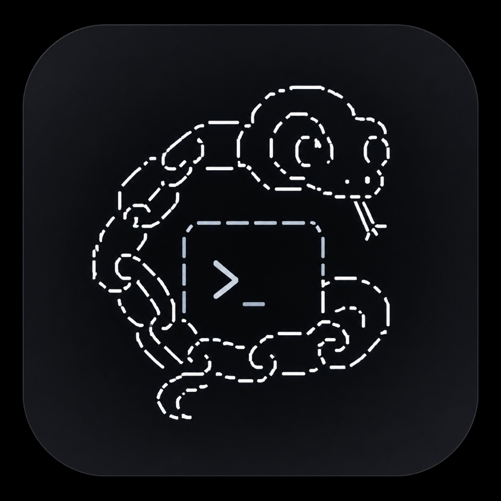
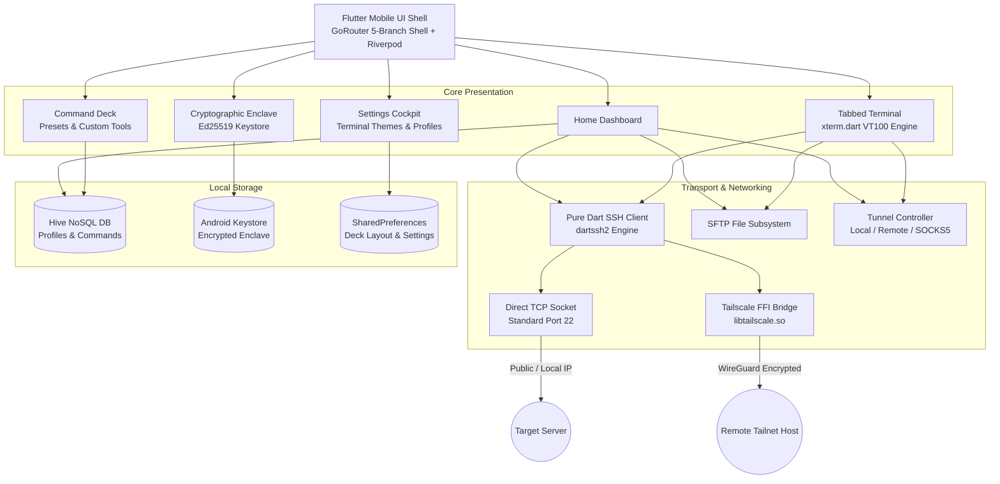

<div align="center">



# TETHER

**Pocket SSH & Embedded Tailscale Mesh Terminal for Android**

[](https://github.com/narcisoJavier/Tether/releases)
[](https://github.com/narcisoJavier/Tether)
[](https://flutter.dev)
[](https://dart.dev)
[](https://tailscale.com)
[](https://www.wireguard.com)
[](LICENSE)

<br />

<p align="center">
  <a href="#overview">Overview</a> &bull;
  <a href="#architecture">Architecture</a> &bull;
  <a href="#core-subsystems">Core Subsystems</a> &bull;
  <a href="#command-deck">Command Deck</a> &bull;
  <a href="#installation">Installation</a> &bull;
  <a href="#build--verify">Build & Verify</a> &bull;
  <a href="#security-model">Security Model</a> &bull;
  <a href="#technical-map">Technical Map</a>
</p>

</div>

---

## Overview

Tether is a mobile SSH client, SFTP navigator, and mesh networking terminal engineered specifically for mobile cloud operators and systems engineers. Powered by a pure-Dart SSH engine (`dartssh2`), VT100 terminal emulation (`xterm.dart`), and an in-process Tailscale WireGuard node compiled directly via Go FFI hooks, Tether establishes direct, encrypted connections to any node in your private tailnet without requiring a separate VPN client app.

### Highlights

- **Embedded WireGuard Tailnet**: Directly dials remote tailnet IPs (`100.x.y.z`) and MagicDNS hosts via in-memory FFI socket bridges.
- **Persistent Multi-Tab Terminal**: Seamlessly multiplex concurrent SSH sessions across hosts with independent scrollback buffers, auto-fit column geometry, and gestures.
- **Dynamic Mobile Accessory Ribbon**: Fluid virtual keyboard accessory strip docking smoothly over the software keyboard with tactile access to `CTRL`, `ESC`, `TAB`, arrow keys, and syntax shortcuts.
- **Integrated Command Deck**: Catalog of one-touch AI agent harnesses and developer utilities with phone-style grid layout rearrangement and direct PTY command execution.
- **Android Keystore Cryptography**: Ed25519 keypair generation and password vaulting directly protected inside Android hardware enclaves.
- **Cyber Line-Art Boot Sequence**: Minimalist vector splash animation with 4-phase choreographed canvas path drawing.

---

## Architecture



---

## Core Subsystems

| Subsystem | Engine | Capabilities |
| :--- | :--- | :--- |
| **Terminal Emulator** | `xterm.dart 4.0` | VT100 / ANSI compliance, 256-color palette, 10,000 line scrollback, pinch-to-zoom scaling, dynamic font metrics. |
| **SSH Transport** | `dartssh2 2.18` | Password, public-key, and dual authentication; keep-alive pinging; custom connection timeouts. |
| **Mesh Networking** | `tailscale (Go FFI)` | Userspace WireGuard network stack, MagicDNS resolution, multi-architecture cross-compilation (arm64, armv7, x86_64). |
| **File Navigator** | `SFTP` | Directory tree browsing, file upload, remote download, rename, atomic deletion, safe clipboard previews. |
| **Port Forwarding** | Dynamic Tunneling | Local port forwarding (`-L`), remote reverse forwarding (`-R`), dynamic SOCKS5 proxying (`-D`). |
| **Key Generation** | `pinenacl Ed25519` | On-device Ed25519 signing keypair creation, OpenSSH wire format serialization, public key export. |
| **Credential Storage**| Hardware Keystore | Android Keystore enclave protection for raw private keys and passwords; zero plain-text storage. |

---

## Command Deck

The Command Deck provides rapid execution of mission-critical tasks and AI agent harnesses without manual keyboard typing:

- **AI Agent Harnesses**: Built-in launcher presets for `claude`, `opencode`, `aider`, `codegpt`, and custom harness commands.
- **System Diagnostics**: Instant access to `htop`, `btop`, `docker ps`, `systemctl status`, `journalctl -f`, and disk analysis.
- **Arrangement Mode**: Phone-style long-press grid tile rearrangement with persisted layout order and category groupings.
- **Direct PTY Injection**: Commands are transmitted straight into active VT100 pseudo-terminal standard input with canonical carriage-return termination (`\r`).

---

## Installation

### Pre-Built Binary

Download the latest production APK directly from the [Releases](https://github.com/narcisoJavier/Tether/releases) page:

```bash
# Verify attached device
adb devices

# Install release APK
adb install -r Tether-v0.6.1.apk
```

### System Requirements

- Android 7.0 (API Level 24) or higher
- Architectures: `arm64-v8a` (recommended), `armeabi-v7a`, `x86_64`

---

## Build & Verify

### Prerequisites

- Flutter SDK `^3.24.0` or higher (Dart `^3.5.0`)
- Android SDK with Platform 34+
- Go `1.22+` (for compiling embedded Tailscale binaries)
- Android NDK `r26b` or newer

### Local Build Steps

```bash
# Clone repository
git clone https://github.com/narcisoJavier/Tether.git
cd Tether

# Resolve dependencies
flutter pub get

# Run static analysis
dart analyze lib/ test/

# Execute test suite
flutter test

# Compile release APK
flutter build apk --release
```

Compiled release binaries are output to `build/app/outputs/flutter-apk/app-release.apk`.

---

## Security Model

- **Zero Cloud Telemetry**: Tether transmits zero tracking events, analytics, or connection logs. All operations remain strictly client-side.
- **Encrypted Keystore Vault**: SSH private keys and server passwords are kept inside the Android OS Keystore using AES-256 hardware-backed encryption.
- **Scoped Export Manifests**: JSON configuration exports exclude sensitive private keys and credentials, safeguarding backup files against exposure.
- **Seccomp Protection**: Automatic runtime ABI detection guards against unauthorized syscalls on virtualized environments.
- **Biometric Gate**: Integrated Android biometric authentication (fingerprint / facial recognition) before access to saved profiles and terminal sessions.

---

## Technical Map

```text
Tether/
├── lib/
│   ├── main.dart                      Entrypoint, Hive initialization, Riverpod root
│   ├── app_router.dart                GoRouter persistent five-branch shell definition
│   ├── app_theme.dart                 Material3 dark glassmorphism theme system
│   ├── models/                        Data classes (ConnectionProfile, StoredKeyPair, etc.)
│   ├── screens/
│   │   ├── home_screen.dart           Host dashboard, connection health indicators
│   │   ├── tabbed_terminal_screen.dart Persistent multi-tab VT100 terminal
│   │   ├── quick_commands_screen.dart Command Deck manager and execution grid
│   │   ├── key_management_screen.dart Cryptographic enclave & keypair manager
│   │   ├── settings_screen.dart       Appearance, terminal themes, update center
│   │   ├── sftp_screen.dart           Remote file explorer and transfer panel
│   │   ├── tunnel_screen.dart         Port forwarding & SOCKS5 proxy controller
│   │   └── cyber_splash_screen.dart   Canvas vector cyber boot sequence
│   ├── services/                      Core business logic, SSH and Tailscale services
│   ├── utils/                         Constants, ANSI theme palettes, key encoders
│   └── widgets/                       Reusable UI components, custom controls
├── packages/tailscale/                Embedded Go FFI bridge package
└── test/                              Unit & widget test suite
```

---

## License

Tether is distributed under the [MIT License](LICENSE).
Tailscale is a registered trademark of Tailscale Inc. All other trademarks belong to their respective owners.
